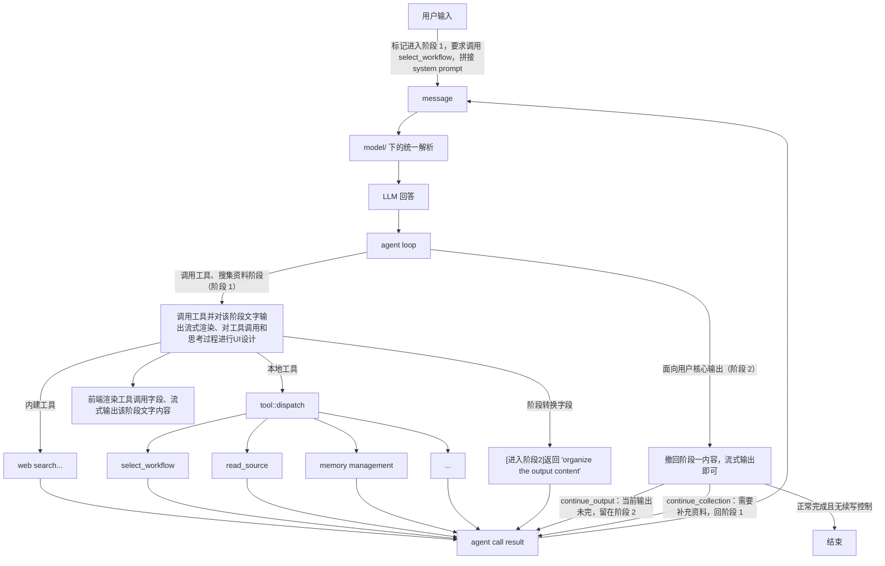

```mermaid
flowchart TD
    A["用户输入"] -->|标记进入阶段 1，要求调用 select_workflow，拼接 system prompt| B["message"]
    C["agent call result"] --> B
    B --> D["model/ 下的统一解析"]
    D --> E["LLM 回答"]
    E --> F["agent loop"]
    F -->|调用工具、搜集资料阶段（阶段 1）| G["调用工具并对该阶段文字输出流式渲染、对工具调用和思考过程进行UI设计"]
    G -->|内建工具| H["web search..."]
    G -->|本地工具| I["tool::dispatch"]
    G -->|阶段转换字段| M["[进入阶段2]返回 'organize the output content'"]
    G --> O["前端渲染工具调用字段、流式输出该阶段文字内容"]
    I --> J["select_workflow"]
    I --> K["read_source"]
    I --> L["memory management"]
    I --> P["..."]
    H --> C
    J --> C
    K --> C
    L --> C
    P --> C
    M --> C
    F -->|面向用户核心输出（阶段 2）| N["撤回阶段一内容，流式输出即可"]
    N -->|正常完成且无续写控制| 结束
    N -->|continue_output：当前输出未完，留在阶段 2| C
    N -->|continue_collection：需要补充资料，回阶段 1| C
```
